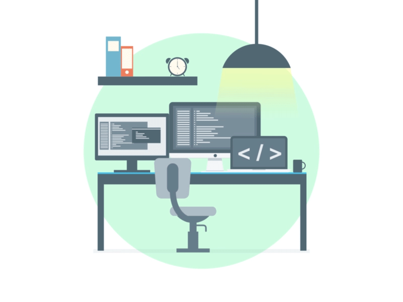

<h1 align="center">Hi there, I'm Asif   👨🏼‍💻</h1>

<samp>
  𝑰'𝒎 𝒂 𝒉𝒊𝒈𝒉𝒍𝒚 𝒊𝒏𝒏𝒐𝒗𝒂𝒕𝒊𝒗𝒆, 𝒂𝒎𝒃𝒊𝒕𝒊𝒐𝒖𝒔, 𝒂𝒏𝒅 𝒇𝒐𝒄𝒖𝒔𝒆𝒅 𝑪𝒐𝒎𝒑𝒖𝒕𝒆𝒓 𝑬𝒏𝒈𝒊𝒏𝒆𝒆𝒓𝒊𝒏𝒈 𝒔𝒕𝒖𝒅𝒆𝒏𝒕 𝒘𝒉𝒐 𝒆𝒏𝒋𝒐𝒚𝒔 𝒕𝒖𝒓𝒏𝒊𝒏𝒈 𝒘𝒉𝒂𝒕 𝑰 𝒍𝒆𝒂𝒓𝒏 𝒊𝒏𝒕𝒐 𝒑𝒓𝒂𝒄𝒕𝒊𝒄𝒂𝒍 𝒑𝒓𝒐𝒋𝒆𝒄𝒕𝒔. 𝑰'𝒎 𝒂𝒍𝒘𝒂𝒚𝒔 𝒈𝒍𝒂𝒅 𝒕𝒐 𝒄𝒐𝒏𝒏𝒆𝒄𝒕 𝒘𝒊𝒕𝒉 𝒑𝒆𝒐𝒑𝒍𝒆 𝒘𝒉𝒐 𝒂𝒓𝒆 𝒃𝒖𝒊𝒍𝒅𝒊𝒏𝒈 𝒂𝒏𝒅 𝒍𝒆𝒂𝒓𝒏𝒊𝒏𝒈 𝒕𝒐𝒐.
</samp>

<h3 align="center"> :: My Tech-Stack Includes :: </h3>

<h4 align='center'>{ Programming Languages }</h4>

  &nbsp;&nbsp;
      

<h4 align="center">Web Technologies</h4>

  &nbsp;&nbsp;
     
  &nbsp;&nbsp;&nbsp;
  &nbsp;&nbsp;&nbsp;

<h4 align='center'>= Databases =</h4>

  &nbsp;&nbsp;&nbsp;

<h3 align="center">🔎 Find me around the web 🌎</h3>
<table align="center" width="100%">
  <tr>
    <td align="center">
      <table align="center" width="100%">
        <tr>
          <td align="center">
            
          </td>
          <td align="center">
            <table align="center" width="100%">
              <tr>
                <td align="center">
                  
                </td>
              </tr>
              <tr>
                <td align="center">
                  
                </td>
              </tr>
            </table>
          </td>
        </tr>
      </table>
    </td>
    <td align="center">
      
    </td>
  </tr>
</table>

  

<h5 align="center">
  / <> with 🧡 By <a href="https://github.com/asifreyaj08-cmd">Asif</a> /
</h5>
